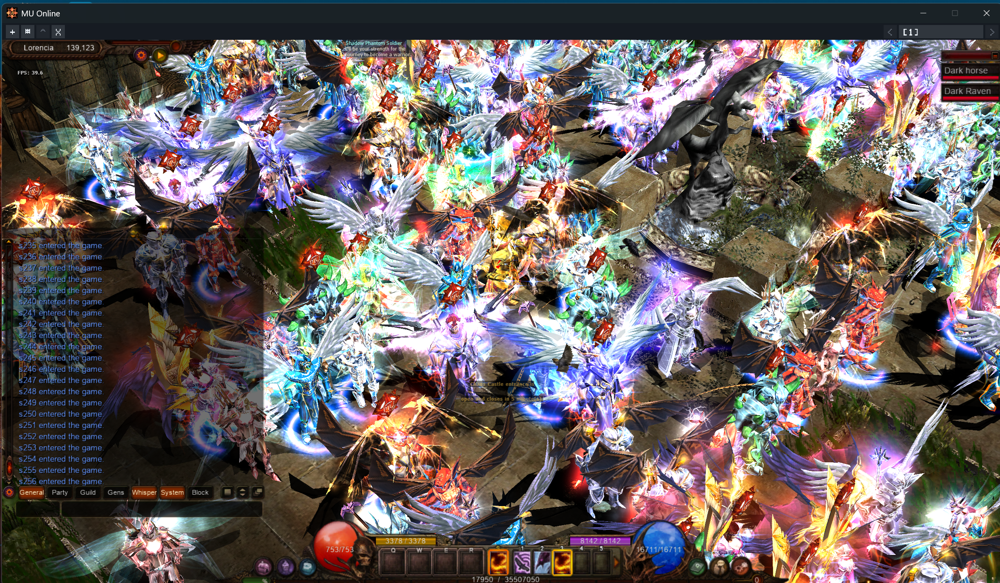
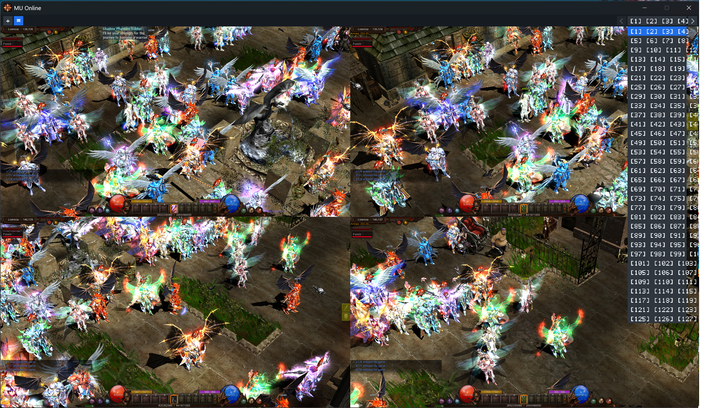

# Mu Client + Launcher

This repository contains the Windows client, launcher, runtime assets, and everything required to build them.

## Screenshots






## Quick start

### Use an existing build

1. Open `bin/<architecture>/<configuration>/`.
2. Run `MuLauncher.exe`.
3. Configure the server address and client options.
4. Start the client. The launcher uses `Main.exe` from the same folder.

Example: `bin/x64/Release/MuLauncher.exe`

### Build from source

Requirements:

- Windows 10 or Windows 11
- Visual Studio 2022 with **Desktop development with C++**
- CMake 3.25 or newer
- .NET SDK 10
- Ninja only when using the Ninja generator

Open PowerShell in the repository root and run:

```powershell
.\Build.ps1
```

The default build is x64 Release with Visual Studio. It builds both the client and launcher.

Useful examples:

```powershell
# x86 Release
.\Build.ps1 -Architecture x86

# x64 Debug
.\Build.ps1 -Configuration Debug

# Client only with Ninja
.\Build.ps1 -Component Client -Generator Ninja

# Launcher only
.\Build.ps1 -Component Launcher
```

Final ready-to-play files are placed in:

```text
bin/<architecture>/<configuration>/
```

All intermediate files, caches, downloaded packages, and debug symbols stay under `build/`.

## Repository map

```text
MuSource/
├─ src/
│  ├─ client/           Native C++ client
│  ├─ client-library/   Managed networking library
│  ├─ launcher/         Avalonia launcher
│  └─ generated/        Generated C++ and shader source required by release builds
├─ assets/
│  ├─ runtime/          Files copied beside Main.exe
│  ├─ source/           Editable UI source assets
│  └─ localization/     Localization source files
├─ vendor/
│  ├─ third-party/      Required third-party source
│  └─ prebuilt/         Required headers and static libraries
├─ cmake/               CMake modules and toolchains
├─ build/               Intermediates, caches, packages, and symbols
└─ bin/                 Final ready-to-play builds
```

## Direct CMake use

Available configure presets:

- `vs2022-x64`
- `vs2022-x86`
- `ninja-x64`
- `ninja-x86`

Example:

```powershell
cmake --preset vs2022-x64
cmake --build --preset vs2022-x64-release
```

Build parallelism is limited to 8 jobs.

## Package scope

This is a focused release-source package. Project tests, development tools, internal documentation, Git history, IDE caches, logs, and old build folders are intentionally excluded. Generated release source is included so the client builds without the removed project tools.
